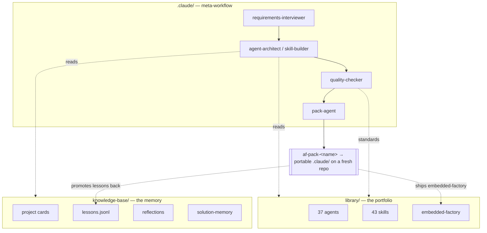

<div align="center">

# 🏭 Agent Factory

**A meta-workflow for building Claude Code agents, skills and `.claude/` configurations — and a system that learns from every project it ships.**

[](LICENSE)
[](https://claude.com/claude-code)


*by [LogicMorrow](https://github.com/LogicMorrow)*

</div>

---

## What is this?

Agent Factory is **not an application** — it's a *factory* that produces portable, deployable agent/skill packages for **other** projects. Think of it as an opinionated, self-improving assembly line for AI-assisted software development with [Claude Code](https://claude.com/claude-code).

You describe a project. The factory interviews you, designs purpose-built sub-agents and skills, quality-checks them against its own standards, bundles them into a portable `.claude/` package, ships it to a fresh git repo — and then **records what it learned** so the next project starts smarter.

The result is a growing **library** (currently **37 agents + 43 skills** across `universal / webapp / cli / automation / ai-agents` tiers) and a **knowledge base** that compounds over time.

## Why it might interest you

- 🧩 **A real, opinionated agent/skill library** — production-shaped Claude Code sub-agents (architects, reviewers, builders, planners) and skill packs you can read, fork, and adapt.
- 🔁 **A closed learning loop** — every project feeds back lessons, reflections and "solution memories" into the factory. Two axes: *what the operator said* (conversation-learning) and *what the project did* (solution-memory). See [`docs/how-it-works.md`](docs/how-it-works.md).
- 🪆 **Embedded factory** — every shipped package carries a *mini-factory* inside it, so downstream projects keep learning and can promote their best lessons back upstream (federation).
- 🎚️ **Model routing as a first-class concern** — a `model-routing` skill drives every agent toward the cheapest model that can do the job (`opus` → architecture, `sonnet` → building, `haiku` → file ops). Token economy by design.
- 🚦 **Quality gates that block** — nothing leaves the factory without passing automated checks (frontmatter, dependencies, anti-PII scans, audit-readiness for production webapps).

## Architecture at a glance



## The workflow

| Step | Command | What happens |
|---|---|---|
| 1. Interview | `/new-agent` · `/new-skill` | A deep business interview runs **before** any design — no brief, no build. |
| 2. Design | (architect / builder) | Reads the brief + project card + recent reflections, designs to standards. |
| 3. Validate | (quality-checker) | PASS/FAIL against the factory's rules. No silent failures. |
| 4. Bootstrap | `/new-project` | Scaffolds a new project and copies the matching agents/skills. |
| 5. Package | `/pack` | Builds `af-pack-<name>` (with embedded-factory) and pushes it to GitHub. |
| 6. Learn | `/log-lesson` · `/review-lessons` | Captures lessons; periodic meta-review proposes systemic improvements. |

## Repository layout

```
.claude/            meta-agents, slash-commands and meta-skills (the workflow itself)
library/
├── agents/         universal · webapp · cli · automation · ai-agents
├── skills/         reusable knowledge packs (incl. model-routing)
└── embedded-factory/   the mini-factory bundled into every shipped package
knowledge-base/     the system's memory — project cards, lessons, reflections (here: anonymized examples)
docs/               how-it-works · fork-and-use
```

## Quickstart — fork & use

```bash
# 1. Grab the library you want for your project
git clone https://github.com/LogicMorrow/agent-factory.git
cp -r agent-factory/library/agents/universal/* your-project/.claude/agents/
cp -r agent-factory/library/skills/universal/model-routing your-project/.claude/skills/

# 2. Or run the factory itself in Claude Code and let it build a package for you
cd agent-factory && claude
# then: /new-agent   or   /new-project   or   /pack
```

Full adoption guide: [`docs/fork-and-use.md`](docs/fork-and-use.md).

## Notes

- **Language:** this README is in English for reach; the agents, skills and internal docs are written in **Polish** — that's the authentic working language of the factory.
- **Privacy:** this is a curated, anonymized public mirror. The private factory (where real client work happens) is the source of truth; everything here is generated through an automated, double-gated sanitization pipeline. The `knowledge-base/` here contains **fictional examples only**.

## License

[MIT](LICENSE) © LogicMorrow. Use it, fork it, build on it.
