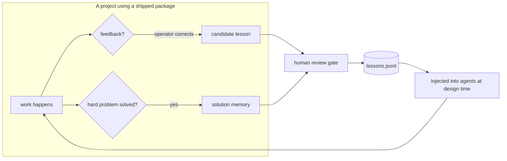

# How the factory learns

The factory's defining feature is that it **compounds**: every project makes the next one cheaper and better. There are two independent learning axes.

## Axis 1 — conversation-learning (*what the operator said*)

When you correct the factory or confirm an approach, that feedback is captured as a **candidate lesson**. Candidates are reviewed (a human gate) and the useful ones are promoted into `knowledge-base/lessons.jsonl`. Lessons are then injected back into the relevant agents at design time.

## Axis 2 — solution-memory (*what the project did*)

When a project struggles with a hard problem and finally solves it, a `Stop` hook reconstructs the **problem → dead-ends → solution** path and records it. Next time a similar problem appears, the recall step surfaces that memory so the project doesn't re-walk the blind alleys.

## Federation — packages learn, and teach back

Every package shipped by `/pack` carries an **embedded-factory**: a mini version of the learning machinery. A downstream project keeps collecting lessons locally, and can **promote** its best ones back upstream to the factory through a reviewed merge. The factory aggregates lessons across many packages and only adopts what proves itself repeatedly.

This is why the library and knowledge base grow without the operator hand-writing every rule: the system observes its own output in the field and feeds the signal back.

## Quality gates

Learning is paired with hard gates so quality never silently regresses:

- **Interview-first** — no agent or skill is designed without a business brief.
- **quality-checker PASS** — frontmatter, minimal tool set, "what it does NOT do" section, dependency consistency.
- **Anti-PII / anti-secret scans** — before anything is packaged or published.
- **Audit-ready checklist** — production webapp packages must satisfy a full infrastructure checklist (Docker, CI/CD, observability, backup/DR, threat model, ...) before they ship.

## Model routing

Every agent declares the cheapest capable model. The `model-routing` skill is the contract:

| Model | Used for |
|---|---|
| `opus` | architecture, agent design, pattern analysis, security |
| `sonnet` | coding, skill building, bootstrap, rule-based validation |
| `haiku` | file ops, grep, formatting, simple transforms |

The effect is that a multi-step task spreads across tiers instead of paying `opus` rates for file moves.
