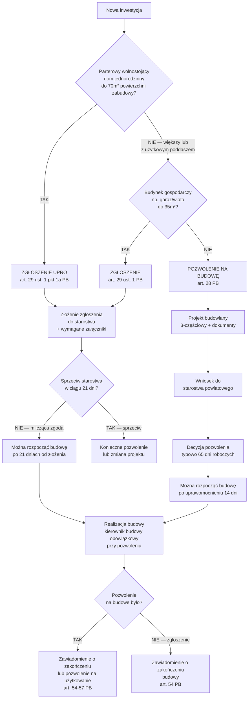

# Pozwolenia i zgłoszenia — Prawo Budowlane 2026

Plik towarzyszący do `SKILL.md` skilla `construction-domain-rules`.
Zakres: decyzje administracyjne wymagane przy realizacji inwestycji GW PL. Podstawa: Ustawa Prawo Budowlane (Dz.U. 1994 nr 89 poz. 414 z późn. zm., nowelizacje do 2026).

> **DISCLAIMER:** Informacje mają charakter ogólny i edukacyjny. Przepisy mogą ulec zmianie. Przed inwestycją skonsultuj się z architektem, prawnikiem lub urzędem starostwa powiatowego. Niniejszy plik nie stanowi porady prawnej.

---

## 1. Flowchart decyzyjny

### Diagram mermaid

### Wersja tekstowa (dla czytelności bez renderowania mermaid)

1. **Parterowy wolnostojący dom do 70m²?** → Zgłoszenie UPRO (art. 29 ust. 1 pkt 1a)
2. **Dom większy lub z użytkowym poddaszem?** → Pozwolenie na budowę (art. 28)
3. **Garaż/wiata/budynek gospodarczy do 35m²?** → Zgłoszenie (art. 29 ust. 1)
4. **Garaż/budynek gospodarczy powyżej 35m²?** → Pozwolenie na budowę (art. 28)
5. **Zmiana sposobu użytkowania?** → Zgłoszenie zmiany użytkowania (art. 71)
6. Po zakończeniu budowy z pozwoleniem: **zawiadomienie o zakończeniu** lub **pozwolenie na użytkowanie** (art. 54-57)

---

## 2. Tabela decyzyjna — klucz

| Typ inwestycji | Wymagane | Art. PB | Uwagi |
|---|---|---|---|
| Dom parterowy wolnostojący ≤70m² pow. zabudowy | Zgłoszenie UPRO | art. 29 ust. 1 pkt 1a | Wolnostojący, nie bliźniak; milcząca zgoda 21 dni |
| Dom z użytkowym poddaszem (każdy rozmiar) | Pozwolenie na budowę | art. 28 | Poddasze użytkowe = kondygnacja = poza zakresem zgłoszenia |
| Dom >70m² (parterowy lub piętrowy) | Pozwolenie na budowę | art. 28 | Powyżej progu 70m² zawsze pozwolenie |
| Bliźniak (każdy rozmiar) | Pozwolenie na budowę | art. 28 | Bliźniak nie jest "wolnostojący" |
| Garaż wolnostojący ≤35m² | Zgłoszenie | art. 29 ust. 1 | Milcząca zgoda 21 dni |
| Garaż wolnostojący >35m² | Pozwolenie na budowę | art. 28 | |
| Wiata/zadaszenie do 50m² | Zgłoszenie | art. 29 ust. 1 | Maksymalnie 2 na działkę |
| Hala stalowa >35m² | Pozwolenie na budowę | art. 28 | |
| Zmiana użytkowania (garaż → mieszkalny) | Zgłoszenie zmiany użytkowania | art. 71 | Często z przebudową = też pozwolenie |
| Przebudowa zmieniająca parametry | Pozwolenie na budowę | art. 28 | Przebudowa bez zmiany parametrów = zgłoszenie |
| Pozwolenie na użytkowanie (obowiązkowe) | Pozwolenie na użytkowanie | art. 55 | Gdy obiekt wg decyzji tego wymaga lub inwestor chce |
| Zawiadomienie o zakończeniu (opcja) | Zawiadomienie o zakończeniu budowy | art. 54 | Standardowe zakończenie dla domu z pozwoleniem |

---

## 3. Scenariusze — 5 przykładów z decyzją

### Scenariusz 1: Dom 120m² parterowy + 40m² użytkowe poddasze

**Opis:** Dom wolnostojący, jednorodzinny, parterowy z poddaszem użytkowym. Powierzchnia zabudowy 120m², powierzchnia użytkowa ~160m².

**Decyzja:** **Pozwolenie na budowę** (art. 28 PB).

**Uzasadnienie:** Poddasze użytkowe traktowane jest jako kondygnacja — budynek NIE jest wyłącznie parterowy. Przekroczony próg 70m² powierzchni zabudowy to DODATKOWY argument. Oba warunki łącznie → pozwolenie.

**Wymagane dokumenty:** Projekt budowlany 3-częściowy (projekt zagospodarowania działki + projekt architektoniczno-budowlany + projekt techniczny), wypis i wyrys MPZP lub warunki zabudowy, oświadczenia o prawie do dysponowania nieruchomością.

---

### Scenariusz 2: Dom parterowy 65m² bez poddasza użytkowego

**Opis:** Dom wolnostojący, jednorodzinny, wyłącznie parterowy (strop + dach nieużytkowy). Powierzchnia zabudowy 65m².

**Decyzja:** **Zgłoszenie UPRO** (art. 29 ust. 1 pkt 1a PB).

**Uzasadnienie:** Spełnione oba warunki: (1) dom parterowy bez poddasza użytkowego, (2) powierzchnia zabudowy ≤70m², (3) wolnostojący (nie bliźniak). Milcząca zgoda po 21 dniach od złożenia zgłoszenia — jeśli brak sprzeciwu starostwa.

**Wymagane dokumenty przy zgłoszeniu:** Formularz zgłoszenia + projekt budowlany (uproszczony dla UPRO) + oświadczenie o prawie do dysponowania nieruchomością + szkic usytuowania + decyzja WZ (jeśli brak MPZP).

**Uwaga:** Mimo zgłoszenia wymagane jest ustanowienie kierownika budowy i prowadzenie dziennika budowy.

---

### Scenariusz 3: Garaż wolnostojący 40m² przy domu

**Opis:** Garaż wolnostojący, niepołączony z domem, powierzchnia zabudowy 40m².

**Decyzja:** **Pozwolenie na budowę** (art. 28 PB).

**Uzasadnienie:** Garaż przekracza próg 35m² — poza zakresem zgłoszenia. Mimo że budynek "gospodarczy", rozmiar przekroczony → pozwolenie.

**Gdyby garaż miał 30m²:** Zgłoszenie (art. 29 ust. 1) — milcząca zgoda 21 dni.

---

### Scenariusz 4: Zmiana użytkowania garażu na pomieszczenie mieszkalne

**Opis:** Istniejący garaż 25m² przy domu — inwestor chce zmienić go na pokój/gabinet z ogrzewaniem.

**Decyzja:** **Zgłoszenie zmiany sposobu użytkowania** (art. 71 PB) + ewentualne pozwolenie na przebudowę.

**Uzasadnienie:** Zmiana sposobu użytkowania zawsze wymaga zgłoszenia (art. 71). Jeśli zmiana wiąże się z robotami budowlanymi zmieniającymi parametry (np. dobudowanie okna, zmiana izolacji) → dodatkowo pozwolenie na przebudowę lub zgłoszenie robót.

**Anti-pattern:** Przeprowadzenie zmiany użytkowania bez zgłoszenia = samowola budowlana — grozi nakazem przywrócenia poprzedniego stanu lub karą finansową (art. 48 PB).

---

### Scenariusz 5: Hala stalowa 200m² — budynek gospodarczy zakładu GW

**Opis:** Hala magazynowa / warsztatowa na terenie zakładu GW — stalowa, parterowa, powierzchnia zabudowy 200m².

**Decyzja:** **Pozwolenie na budowę** (art. 28 PB).

**Uzasadnienie:** Powierzchnia powyżej 35m² progu dla budynków gospodarczych. Hala stalowa wymaga projektu technicznego (EC3 — konstrukcje stalowe). Zalecane też pozwolenie na użytkowanie (art. 55) przy budynkach użytkowych (bezpieczeństwo pożarowe, sanepid).

**Uwaga o MPZP:** Hala przemysłowa wymaga terenu oznaczonego w MPZP jako P (przemysłowy) lub PU (produkcyjno-usługowy). Sprawdź MPZP PRZED zakupem działki pod zakład GW.

---

## 4. Anti-patterns — 3 najczęstsze błędy

### Błąd 1: Rozpoczęcie budowy przed milczącą zgodą

**Co się dzieje:** Inwestor składa zgłoszenie UPRO, ale zaczyna prace po 5 dniach, nie czekając na 21-dniowy termin.

**Ryzyko:** Samowola budowlana (art. 48 PB). PINB może nakazać rozbiórkę lub legalizację (opłata legalizacyjna może wynieść 50 000 – 500 000 PLN).

**Prawidłowe postępowanie:** Poczekać pełne 21 dni od doręczenia zgłoszenia do urzędu. Jeśli w ciągu 21 dni brak sprzeciwu → milcząca zgoda → można zacząć. Alternatywa: wnioskować o zaświadczenie o braku sprzeciwu (przyspiesza pewność).

---

### Błąd 2: Zgłoszenie dla domu z poddaszem użytkowym

**Co się dzieje:** Inwestor planuje dom "parterowy z antresolą" i zakłada, że może złożyć zgłoszenie (bo mówi "parterowy").

**Ryzyko:** Jeśli antresola lub poddasze jest użytkowe (okna dachowe, schody stałe, meble) — traktowane jest jako kondygnacja. Zgłoszenie nieważne → budowa bez wymaganego pozwolenia = samowola.

**Prawidłowe postępowanie:** Jeśli poddasze ma być użytkowe (nawet częściowo) → pozwolenie na budowę. Gdy wątpliwości — skonsultuj z architektem lub starostwem przed złożeniem dokumentów.

---

### Błąd 3: Pominięcie zgłoszenia zmiany użytkowania

**Co się dzieje:** GW adaptuje garaż na biuro lub pomieszczenie socjalne bez powiadamiania urzędu.

**Ryzyko:** Naruszenie art. 71 PB. Podczas kontroli PINB może nakazać przywrócenie poprzedniego stanu. W przypadku późniejszej sprzedaży nieruchomości — nielegalna zmiana użytkowania obniża wartość lub blokuje transakcję (wpis do KW).

**Prawidłowe postępowanie:** Przed jakąkolwiek zmianą funkcji pomieszczenia → sprawdzić art. 71 PB i złożyć zgłoszenie zmiany użytkowania (termin oczekiwania: 30 dni).

---

## 5. Kontakty i weryfikacja

- **Starostwo powiatowe** — wniosek o pozwolenie na budowę lub zgłoszenie; właściwe wg lokalizacji działki
- **PINB (Powiatowy Inspektor Nadzoru Budowlanego)** — nadzór budowlany, pozwolenia na użytkowanie, kontrole
- **Geoportal.gov.pl** — MPZP online, warunki zabudowy, mapa ewidencji gruntów
- **Isap.sejm.gov.pl** — pełny tekst Prawa Budowlanego z nowelizacjami
- **e-budownictwo.gunb.gov.pl** — elektroniczne wnioski budowlane (wniosek online)
