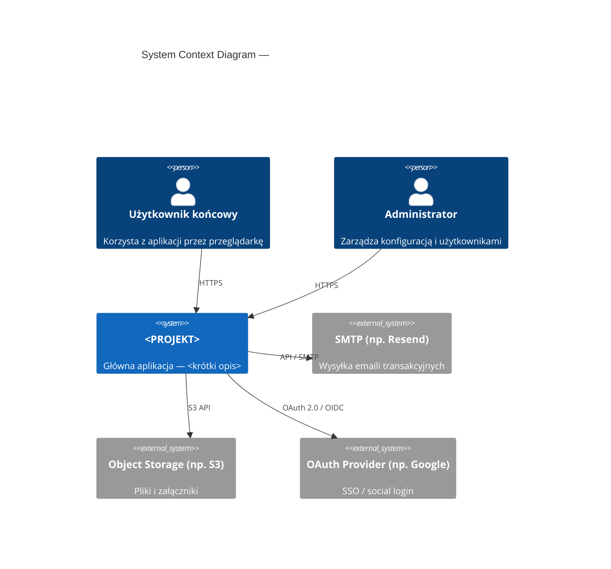
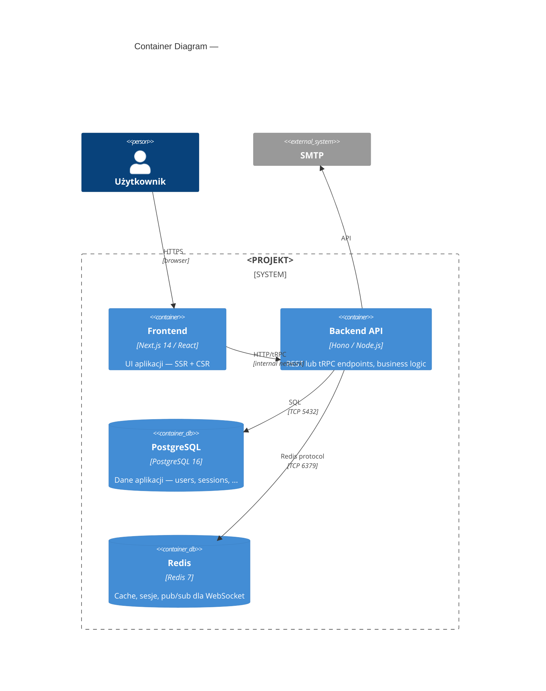
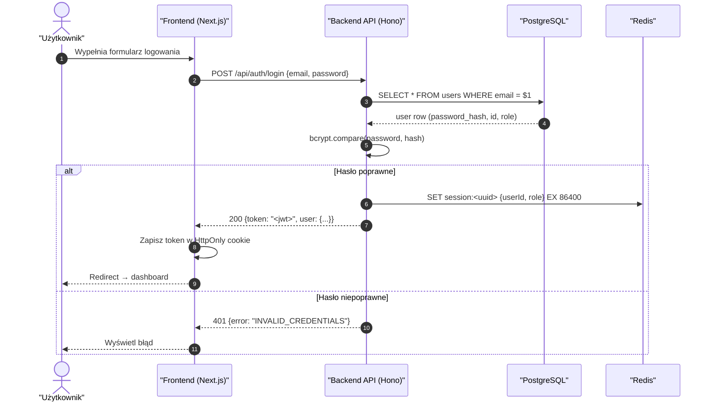
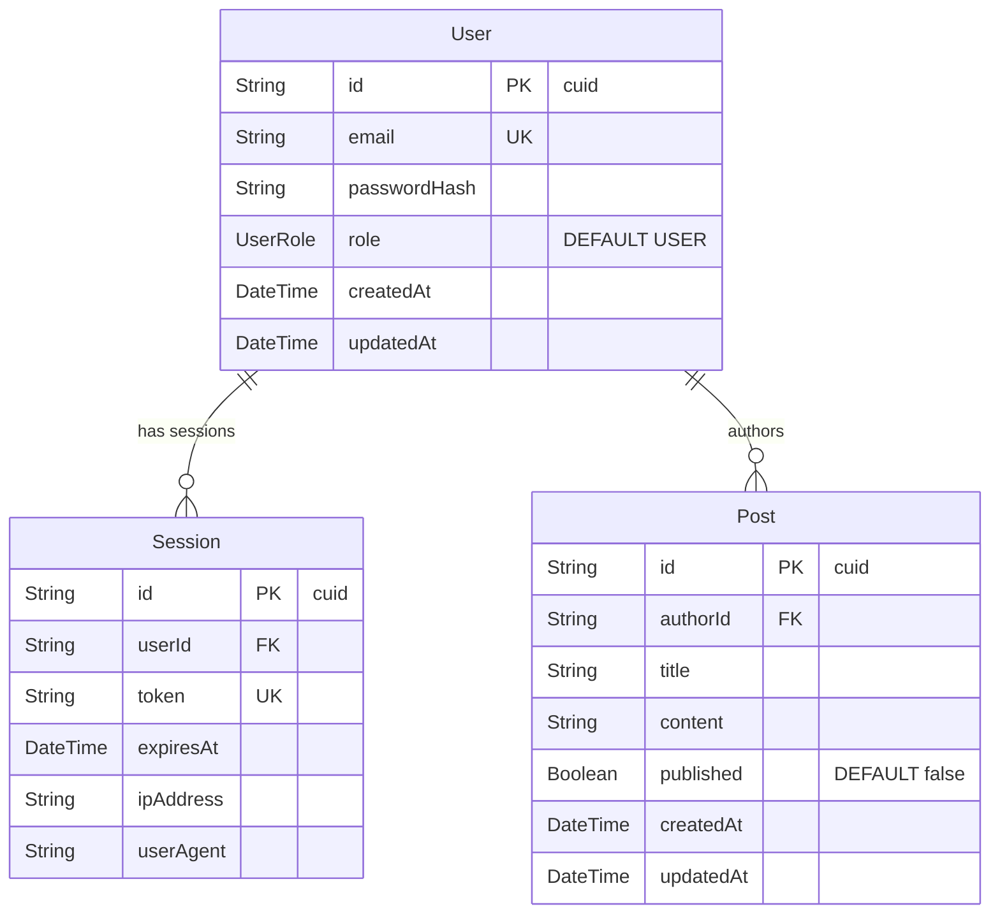
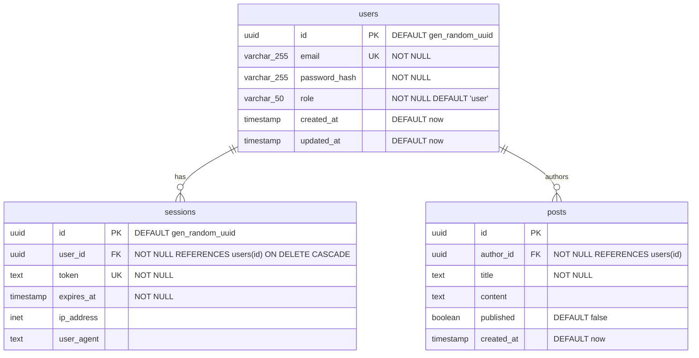
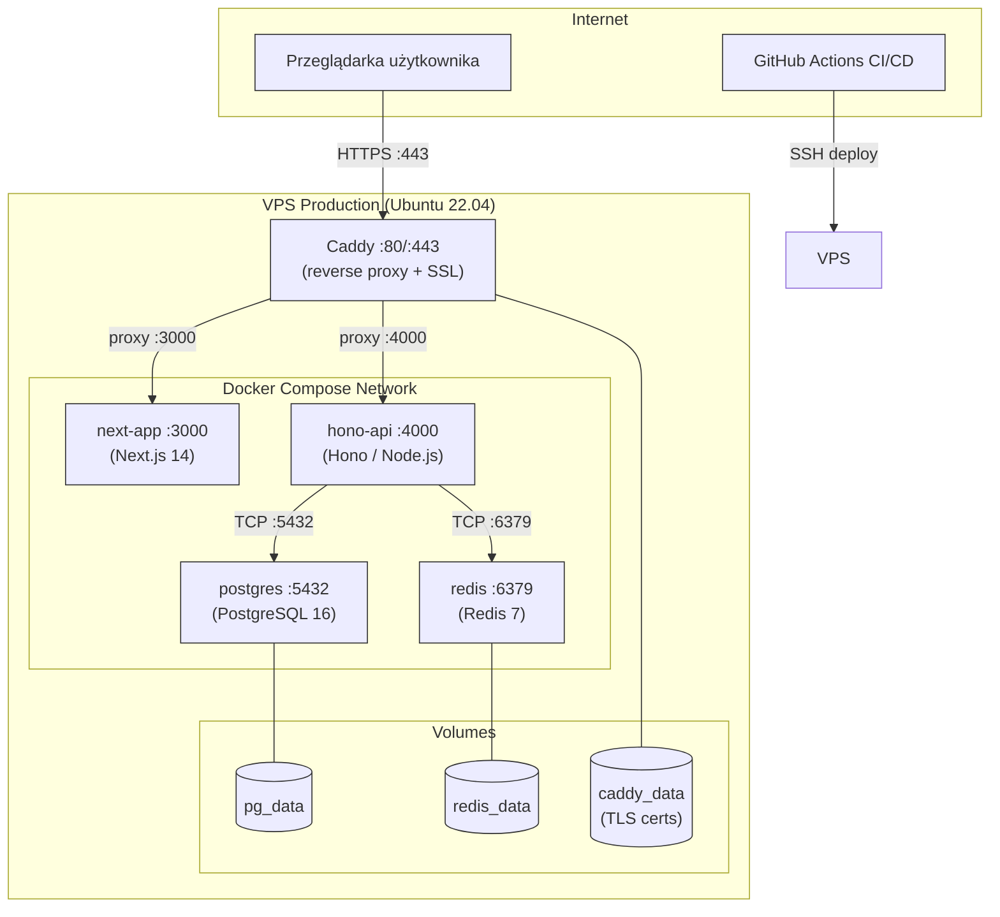

# Mermaid — Gotowe snippety

Użyj jako punkt startowy — kopiuj i dostosuj do projektu. Wszystkie renderują się natywnie na GitHub.

> **Fallback do PlantUML:** gdy diagram jest zbyt złożony (C4 L3 z >10 komponentami, deployment topology z wieloma sieciami) — patrz sekcja "PlantUML fallback" na końcu.

---

## C4 Context Diagram (L1)



---

## C4 Container Diagram (L2)



---

## Sequence — Auth Flow



---

## ERD — Prisma schema style



---

## ERD — SQL/DBML style (czysty PostgreSQL bez ORM)



---

## Deployment Topology

<!--
Użyj dla L3. Dla złożonych topologii z wieloma sieciami rozważ PlantUML fallback.
-->



---

## PlantUML Fallback

Gdy Mermaid nie radzi sobie z diagramem (zbyt duże C4 L3, złożona deployment topology z wieloma sieciami):

1. Napisz diagram w `.puml` (np. `docs/architecture/deployment.puml`)
2. Wyrenderuj do `.svg`: `plantuml -tsvg deployment.puml`
3. Dodaj oba pliki do repo
4. Linkuj SVG w Markdown: ``

**Zasada:** `.puml` źródło MUSI być w repo obok `.svg`. Bez źródła — `*.svg` bez możliwości edycji = takie samo zło jak draw.io bez źródła.

Przykładowy plik `.puml` dla C4 Level 3 (Component):
```plantuml
@startuml
!include https://raw.githubusercontent.com/plantuml-stdlib/C4-PlantUML/master/C4_Component.puml

Container_Boundary(api, "Backend API (Hono)") {
    Component(auth, "Auth Controller", "Hono middleware", "JWT verify, session management")
    Component(users, "Users Router", "Hono router", "CRUD users")
    Component(posts, "Posts Router", "Hono router", "CRUD posts")
    Component(db, "DB Client", "postgres.js", "Raw SQL queries")
    Component(cache, "Cache Client", "ioredis", "Session cache")
}

Rel(auth, cache, "session lookup")
Rel(users, db, "SQL")
Rel(posts, db, "SQL")
@enduml
```
