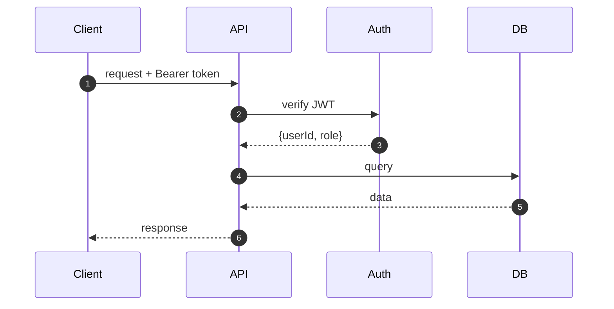

# API Documentation — <PROJEKT>

> **L2+ dokument.** Uzupełnij przed pierwszym zewnętrznym konsumentem lub gdy >1 frontend/klient używa API.
> Ostatnia aktualizacja: YYYY-MM-DD

<!--
Wybierz wariant i usuń niepotrzebny blok:

WARIANT A: tRPC internal (monorepo — web + backend razem)
  → Tylko sekcje 1, 2, 3 (flow diagram), 4 (auth), 5 (error strategy)
  → Bez auto-gen UI, bez full sekcji rate limiting
  → Typ-safety zapewniony przez tRPC — klientem jest wyłącznie własny frontend

WARIANT B: tRPC public / REST / gRPC (publiczne API lub >1 konsument)
  → Wszystkie sekcje 1-9
  → Auto-gen UI obowiązkowy pod /api/docs
-->

---

## 1. Base URL & Versioning

| Środowisko | URL |
|-----------|-----|
| Production | `https://api.<domena>.pl` |
| Staging | `https://api.staging.<domena>.pl` |
| Local dev | `http://localhost:<PORT>` |

**Versioning strategy:** <np. URL path `/v1/...` | Header `API-Version: 1` | brak wersjonowania (internal only)>

**Breaking changes policy:** ...

---

## 2. Authentication

<!--
Opisz jak uzyskać token i jak go używać.
-->

### Jak uzyskać token

```http
POST /api/auth/login
Content-Type: application/json

{
  "email": "user@example.com",
  "password": "secret"
}
```

Response:
```json
{
  "token": "eyJhbGci...",
  "expiresAt": "2026-01-01T00:00:00Z"
}
```

### Jak używać tokenu

```http
GET /api/resource
Authorization: Bearer eyJhbGci...
```

**Token lifetime:** `<np. 24h>` | **Refresh:** `<np. /api/auth/refresh lub brak>`

---

## 3. Flow Diagram *(tRPC internal — wymagany; REST — opcjonalny)*



---

## 4. Rate Limiting *(REST/public — obowiązkowy; tRPC internal — opcjonalny)*

| Endpoint | Limit | Window |
|----------|-------|--------|
| `POST /api/auth/login` | 5 req | 1 min |
| `GET /api/*` (authenticated) | 1000 req | 1 min |
| `GET /api/*` (unauthenticated) | 100 req | 1 min |

**Nagłówki w response:**
- `X-RateLimit-Limit: 1000`
- `X-RateLimit-Remaining: 999`
- `X-RateLimit-Reset: 1700000000`

Przy przekroczeniu: `429 Too Many Requests`

---

## 5. Error Format

Wszystkie błędy zwracają ujednolicony format:

```json
{
  "error": {
    "code": "RESOURCE_NOT_FOUND",
    "message": "User with id 123 not found",
    "details": {}
  }
}
```

**Tabela kodów błędów:**

| HTTP | Code | Kiedy |
|------|------|-------|
| 400 | `VALIDATION_ERROR` | Nieprawidłowe dane wejściowe |
| 401 | `UNAUTHORIZED` | Brak lub nieprawidłowy token |
| 403 | `FORBIDDEN` | Brak uprawnień do zasobu |
| 404 | `RESOURCE_NOT_FOUND` | Zasób nie istnieje |
| 409 | `CONFLICT` | Konflikt (np. duplikat email) |
| 429 | `RATE_LIMIT_EXCEEDED` | Przekroczono limit |
| 500 | `INTERNAL_ERROR` | Błąd serwera (szczegóły w logach) |

---

## 6. Live API UI *(REST/tRPC public — obowiązkowy)*

| Środowisko | URL |
|-----------|-----|
| Production | `https://api.<domena>.pl/api/docs` |
| Staging | `https://api.staging.<domena>.pl/api/docs` |

<!--
Dla REST: Swagger UI (swagger-autogen / zod-to-openapi)
Dla tRPC public: trpc-panel
-->

---

## 7. Changelog (Breaking Changes)

| Wersja | Data | Zmiana | Migracja |
|--------|------|--------|---------|
| v1.1 | YYYY-MM-DD | Usunięto pole `user.name` → `user.firstName` + `user.lastName` | [ADR-NNNN](<ścieżka>) |

---

## 8. E2E Examples

### Przykład 1: Logowanie i pobranie danych

```bash
# 1. Login
TOKEN=$(curl -s -X POST https://api.<domena>.pl/api/auth/login \
  -H 'Content-Type: application/json' \
  -d '{"email":"test@example.com","password":"secret"}' \
  | jq -r '.token')

# 2. Użyj tokenu
curl -s https://api.<domena>.pl/api/users/me \
  -H "Authorization: Bearer $TOKEN" | jq .
```

### Przykład 2: <Drugi kluczowy use case>

```bash
# ...
```

---

## 9. Webhooks *(obowiązkowe gdy aplikacja emituje zdarzenia)*

<!--
USUŃ tę sekcję jeśli aplikacja nie emituje webhooków.
-->

### Zdarzenia

| Event | Kiedy | Payload |
|-------|-------|---------|
| `user.created` | Po rejestracji | `{event, userId, email, timestamp}` |
| `<event>` | ... | ... |

### Format payloadu

```json
{
  "event": "user.created",
  "timestamp": "2026-01-01T00:00:00Z",
  "data": { "userId": "uuid", "email": "user@example.com" }
}
```

### Weryfikacja podpisu

```bash
# Nagłówek: X-Webhook-Signature: sha256=<hmac>
# Weryfikacja po stronie odbiorcy:
echo -n "$PAYLOAD" | openssl dgst -sha256 -hmac "$WEBHOOK_SECRET"
```

### SDK examples *(opcjonalne, minimum curl pokazany powyżej)*

```typescript
// TypeScript / Node
// ...
```
