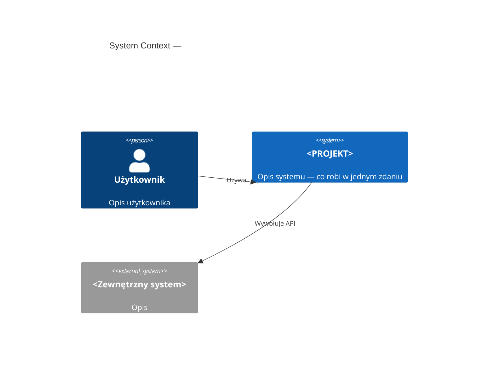
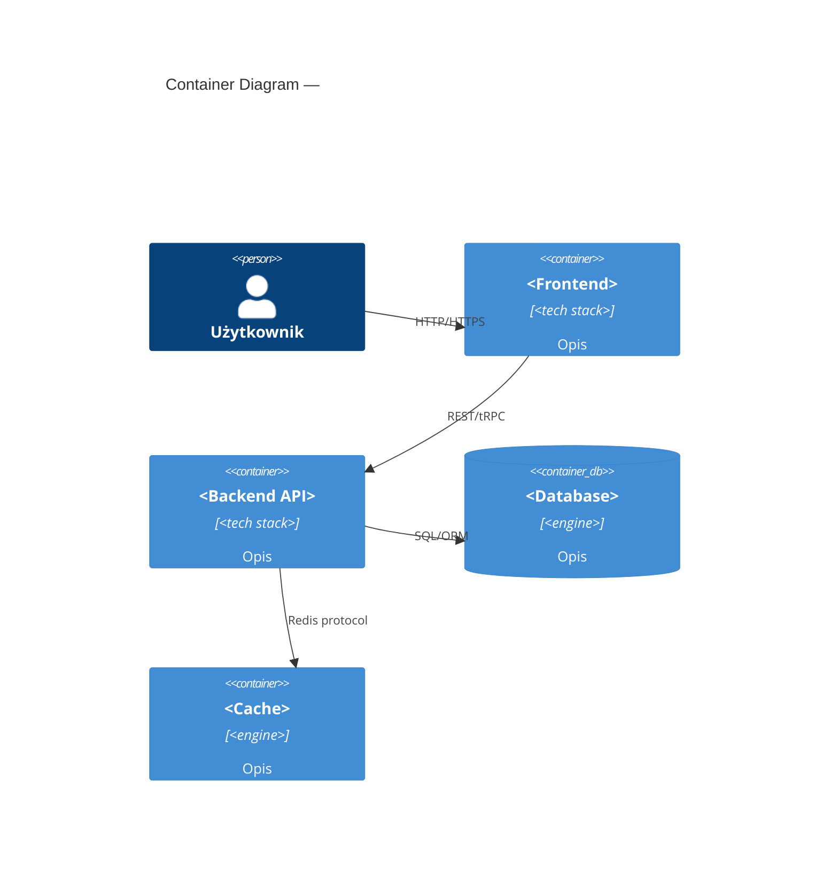
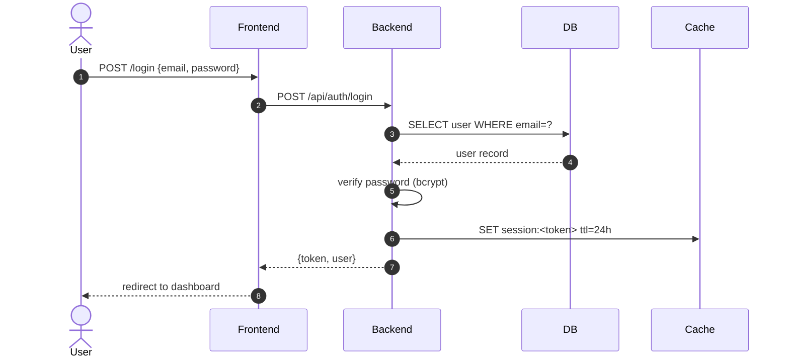
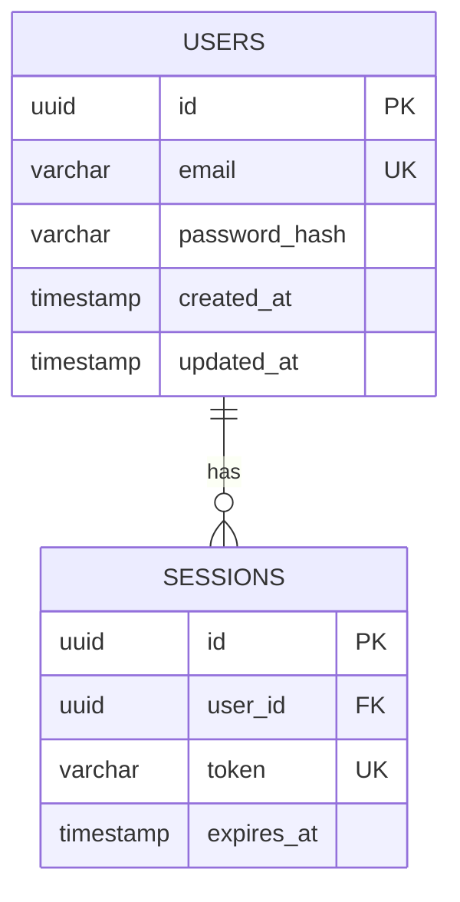
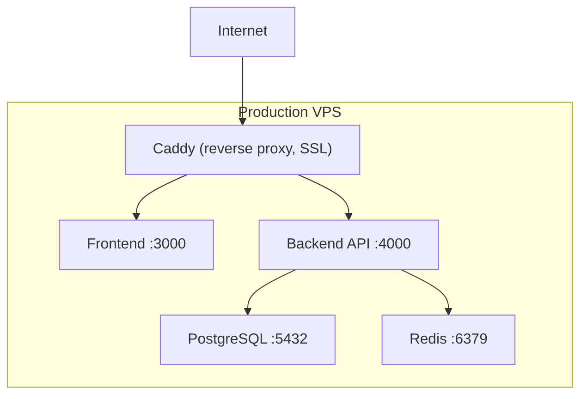

---
# front-matter opcjonalny dla overview.md
last_updated: YYYY-MM-DD
docs_maturity_level: L2
related: []
---

# Architecture Overview — <PROJEKT>

> Dokument utrzymywany ręcznie. Aktualizuj przy każdej zmianie architektury lub nowym ADR `kind: infrastructure`.
> Ostatnia aktualizacja: YYYY-MM-DD

---

## 1. System Context (C4 Level 1)

<!--
C4 Context: pokazuje system i jego użytkowników/zewnętrzne systemy.
Szablon Mermaid poniżej — patrz też references/mermaid-examples.md dla pełnych snippetów.
-->



**Granice systemu:** ...
**Zewnętrzne integracje:** ...

---

## 2. Container View (C4 Level 2) *(L2+)*

<!--
C4 Container: rozbija system na kontenery (procesy, usługi, bazy danych).
Obowiązkowy od L2.
-->



---

## 3. Tech Stack

| Warstwa | Technologia | Wersja | Uzasadnienie / ADR |
|---------|-------------|--------|--------------------|
| Frontend | <np. Next.js> | <wersja> | [ADR-NNNN](<ścieżka>) |
| Backend API | <np. Hono> | <wersja> | [ADR-NNNN](<ścieżka>) |
| Database | <np. PostgreSQL> | <wersja> | [ADR-NNNN](<ścieżka>) |
| Cache | <np. Redis> | <wersja> | [ADR-NNNN](<ścieżka>) |
| Hosting | <np. VPS + Docker> | — | [ADR-NNNN](<ścieżka>) |
| Auth | <np. JWT / NextAuth> | <wersja> | [ADR-NNNN](<ścieżka>) |

---

## 4. Key Flows *(L2+)*

<!--
Min. 1 sequence diagram krytycznego flow.
Obowiązkowy od L2. Typowe: auth flow, główny use case, webhook/event flow.
Snippety: references/mermaid-examples.md → sekcja "Sequence — Auth Flow"
-->

### Flow 1: Autentykacja



### Flow 2: <Nazwa flow> *(opcjonalny)*

```mermaid
sequenceDiagram
    %% TODO
```

---

## 5. Data Model (ERD) *(L2+)*

<!--
ERD dla projektu. Mermaid erDiagram lub DBML.
Dla projektów z Prisma — patrz mermaid-examples.md → sekcja "ERD Prisma".
Dla projektów z czystym SQL/DBML — patrz mermaid-examples.md → sekcja "ERD SQL/DBML".
Obowiązkowy od L2.
-->



**Uwagi do modelu:**
- ...

---

## 6. Deployment Topology *(L3 only)*

<!--
Obowiązkowy tylko na L3 (>3 devs, multiple environments).
PlantUML dopuszczalny dla złożonych topologii — patrz references/mermaid-examples.md → "Deployment".
-->



**Środowiska:**
| Środowisko | URL | Branch | Deploy |
|-----------|-----|--------|--------|
| Production | `https://...` | `main` | manual approval |
| Staging | `https://staging...` | `develop` | automatyczny |

---

## 7. ADR Index

Accepted ADR-y wpływające na obecną architekturę:

| ID | Tytuł | Kind | Data |
|----|-------|------|------|
| [0001](<ścieżka>) | <tytuł> | infrastructure | YYYY-MM-DD |
| [0002](<ścieżka>) | <tytuł> | code | YYYY-MM-DD |

Propozycje: `docs/adr/` (status: proposed)

---

## 8. Trade-offs & Known Limitations

<!--
Świadome kompromisy — czego NIE zrobiliśmy i dlaczego.
To jest najważniejsza sekcja dla przyszłych deweloperów.
-->

| Kompromis | Uzasadnienie | Kiedy revisit |
|-----------|-------------|---------------|
| Brak message queue (tylko Redis pub/sub) | MVP — Redis wystarczy dla <N> msg/s | Gdy >X msg/s lub potrzeba persistence |
| Brak full-text search (tylko ILIKE) | Corpus <Y rekordów, wystarczy | Gdy >Y rekordów lub wymagania PLN |
| ... | ... | ... |

**Known technical debt:**
- patrz [`TECH_DEBT.md`](../TECH_DEBT.md)
