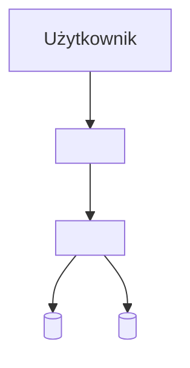

# Onboarding — Projekt <PROJEKT>

> **L2+ dokument.** Wypełnij przed pierwszym nowym deweloperem w projekcie.
> Ostatnia aktualizacja: YYYY-MM-DD | Owner: <imię>

---

## Cel dokumentu

Po przeczytaniu tego dokumentu nowy deweloper powinien być w stanie:
- [ ] uruchomić projekt lokalnie
- [ ] wykonać pierwszy deploy na staging
- [ ] wiedzieć gdzie szukać co w dokumentacji

Szacowany czas od zero do pierwszego działającego środowiska: **~X godzin**

---

## 1. Wymagania wstępne

### Narzędzia

| Narzędzie | Wersja | Instalacja |
|-----------|--------|------------|
| Node.js | ≥20 | `nvm install 20` |
| pnpm | ≥9 | `corepack enable && corepack prepare pnpm@latest --activate` |
| Docker + Compose | ≥26 | [docs.docker.com](https://docs.docker.com/get-docker/) |
| ... | ... | ... |

### Dostępy wymagane przed startem

- [ ] GitHub: dostęp do repo `<org>/<repo>` (poproś <osoba>)
- [ ] Secrets: skopiuj `.env.example` → `.env` i uzupełnij (poproś <osoba> o wartości)
- [ ] VPN / SSH: ... (patrz [`runbooks/_shared-prerequisites.md`](./runbooks/_shared-prerequisites.md))

---

## 2. Setup lokalny

```bash
# 1. Klonuj repo
git clone git@github.com:<org>/<repo>.git && cd <repo>

# 2. Zainstaluj zależności
pnpm install

# 3. Skopiuj i uzupełnij zmienne środowiskowe
cp .env.example .env
# Uzupełnij pola oznaczone REQUIRED

# 4. Uruchom usługi zależne (DB, Redis, etc.)
docker compose up -d

# 5. Uruchom migracje
pnpm db:migrate

# 6. Uruchom dev server
pnpm dev
```

**Weryfikacja:** otwórz `http://localhost:<PORT>` — powinien wyświetlić się ekran startowy.

---

## 3. Struktura projektu

```
<repo>/
├── <frontend-dir>/     # <opis, np. Next.js frontend>
├── <backend-dir>/      # <opis, np. Hono API>
├── <shared-dir>/       # <opis, np. shared types>
├── docs/               # dokumentacja techniczna
│   ├── adr/            # Architecture Decision Records
│   ├── runbooks/       # procedury operacyjne
│   └── architecture/   # diagramy i overview
└── docker-compose.yml
```

Kluczowe pliki:
- `<config-file>` — <opis>
- `<entry-point>` — <opis>

---

## 4. Architektura (skrót)

Pełne szczegóły: [`architecture/overview.md`](./architecture/overview.md)



Krytyczne decyzje architektoniczne (ADR-y accepted):
- [ADR-0001](<ścieżka>) — <tytuł>
- [ADR-0002](<ścieżka>) — <tytuł>

---

## 5. Workflow dewelopera

### Gałęzie

| Gałąź | Cel | Deploy |
|-------|-----|--------|
| `main` | produkcja | automatyczny po merge |
| `develop` | staging | automatyczny po push |
| `feature/*` | feature branch | manual / PR preview |

### Typowy cykl

```bash
git checkout -b feature/<nazwa>
# ... praca ...
git add . && git commit -m "feat(<scope>): <opis>"  # commitlint
git push origin feature/<nazwa>
# Otwórz PR do develop
```

CI (lint / typecheck / test / docs-lint) musi przejść przed merge.

---

## 6. Pierwsze zadanie

Zanim zaczniesz — przetestuj cały flow:

1. Stwórz feature branch: `git checkout -b feature/onboarding-test`
2. Wprowadź trywialną zmianę (np. komentarz w kodzie)
3. Commit + push + otwórz PR
4. Sprawdź czy CI przeszedł
5. Zamknij PR bez merge

---

## 7. Gdzie szukać pomocy

| Problem | Gdzie szukać |
|---------|-------------|
| Architektura / decyzje | `docs/adr/` |
| Procedury ops | `docs/runbooks/` |
| API / endpointy | `docs/api/README.md` |
| Tech debt i known issues | `docs/TECH_DEBT.md` |
| Historia zmian | `git log --oneline` |
| Pytania | <kanał Slack / Teams> lub <osoba> |
